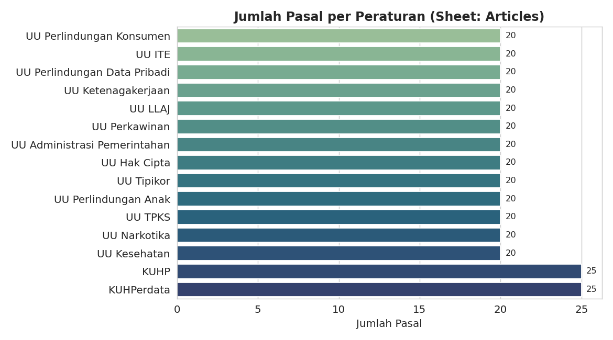
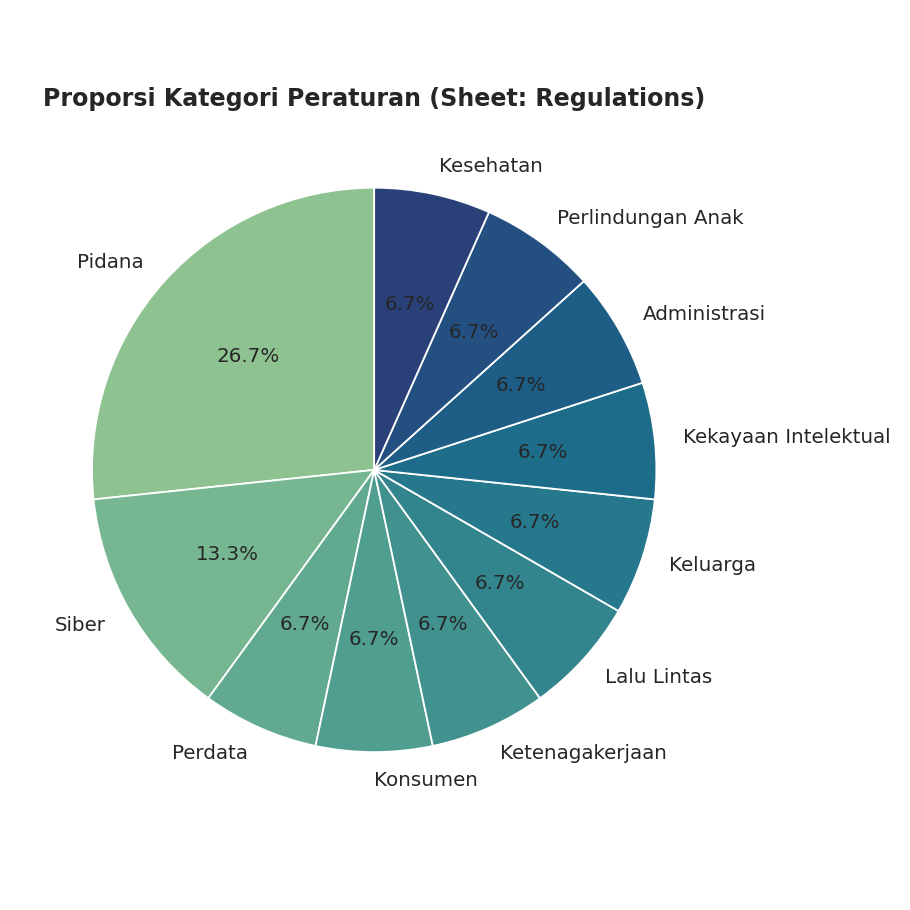
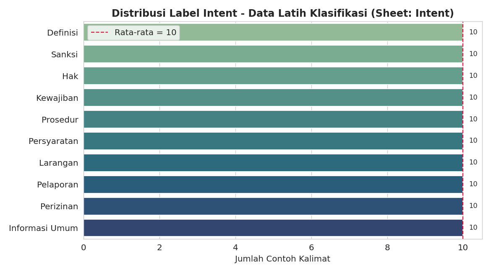
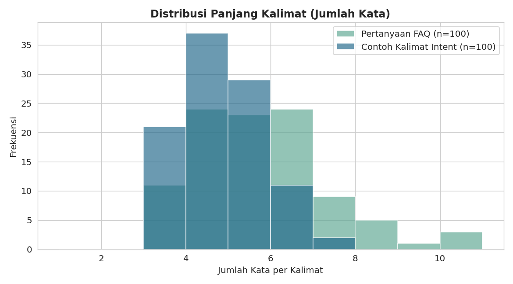
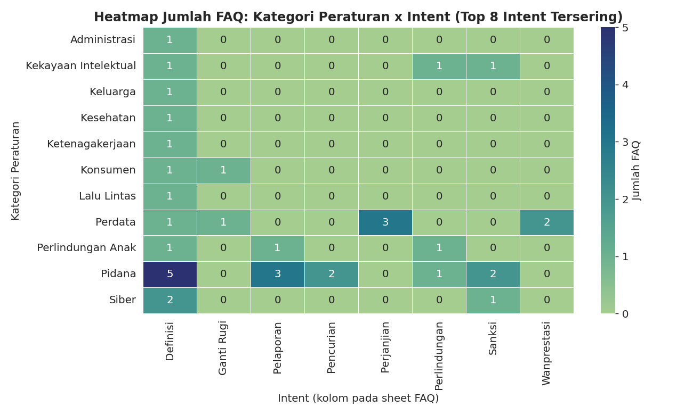
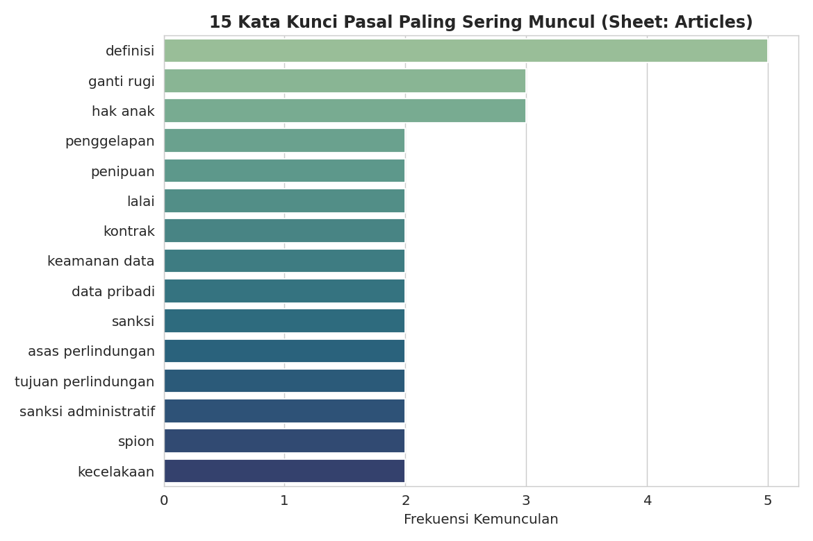

# LAPORAN UJIAN AKHIR SEMESTER (UAS) KECERDASAN BUATAN

**Mata Kuliah:** Kecerdasan Buatan

**Topik Proyek:** Chatbot Konsultasi Hukum Berbasis Natural Language Processing (LAW AI)

**Anggota Kelompok:**

1. Albar Hifdzi Alkariem — 2406092

**LINK/SUMBER Dataset:** Knowledge Base internal (disusun sendiri), file `Knowledge_Base.xlsx`

---

## 1. Judul Proyek

**"Pengembangan Chatbot Konsultasi Hukum Berbasis Natural Language Processing dengan Pendekatan Rule-Based dan TF-IDF (LAW AI)"**

---

## 2. Business Understanding

### Latar Belakang Masalah (Domain Proyek)

Akses terhadap informasi hukum di Indonesia masih menjadi tantangan bagi masyarakat awam. Bahasa hukum yang formal dan tersebar di berbagai peraturan perundang-undangan (KUHP, KUHPerdata, UU ITE, UU Ketenagakerjaan, dan lain-lain) membuat masyarakat kesulitan memahami hak, kewajiban, maupun sanksi yang berlaku terhadap suatu perbuatan. Di sisi lain, konsultasi langsung dengan praktisi hukum (advokat, notaris, atau lembaga bantuan hukum) membutuhkan biaya dan waktu yang tidak selalu bisa dijangkau oleh semua orang, terutama untuk pertanyaan-pertanyaan dasar yang sifatnya edukatif.

Kondisi ini mendorong kebutuhan akan sebuah sistem yang mampu menjawab pertanyaan hukum masyarakat secara instan, menggunakan bahasa sehari-hari (termasuk istilah informal seperti "nyolong" atau "nipu"), dan tetap merujuk pada dasar hukum yang benar.

### Permasalahan Dunia Nyata

1. **Kesenjangan Bahasa Awam vs Bahasa Hukum:** Masyarakat sering menggunakan istilah informal atau sinonim (misalnya "nyolong", "nyuri" untuk "pencurian") yang tidak dikenali langsung oleh sistem pencarian berbasis kata kunci konvensional.
2. **Informasi Hukum yang Tersebar:** Pasal-pasal terkait suatu topik hukum tersebar di berbagai undang-undang berbeda, sehingga masyarakat awam kesulitan menemukan rujukan yang tepat.
3. **Keterbatasan Akses Konsultasi:** Tidak semua masyarakat memiliki akses cepat dan gratis ke konsultan hukum untuk pertanyaan-pertanyaan dasar.

### Tujuan Proyek

1. **Membangun Sistem Pengenalan Istilah Hukum:** Mengembangkan modul yang mampu mengenali peraturan hukum yang relevan dari kalimat bebas pengguna, termasuk dari istilah informal/sinonim.
2. **Mengembangkan Klasifikasi Intent Pengguna:** Membangun model Machine Learning (TF-IDF + Logistic Regression) untuk mengklasifikasikan maksud pertanyaan pengguna ke dalam kategori seperti Definisi, Sanksi, Hak, Kewajiban, Prosedur, dan Persyaratan.
3. **Menyediakan Jawaban yang Relevan:** Mengimplementasikan mesin pencarian FAQ berbasis kemiripan teks (cosine similarity) agar chatbot dapat memberikan jawaban paling relevan dari basis pengetahuan yang tersedia.
4. **Validasi Data:** Memastikan basis pengetahuan (knowledge base) bebas dari data kosong dan duplikat sebelum digunakan sebagai sumber jawaban chatbot.

### Target Pengguna (User)

1. **Masyarakat Umum:** Sebagai pengguna utama yang ingin mendapatkan edukasi hukum dasar secara cepat dan gratis.
2. **Mahasiswa Hukum/Non-Hukum:** Sebagai alat bantu belajar untuk memahami dasar-dasar peraturan perundang-undangan.
3. **Pelaku Usaha Kecil:** Sebagai referensi awal terkait kewajiban hukum, misalnya dalam hal ketenagakerjaan atau perlindungan konsumen.

### Solusi dan Manfaat

Proyek ini membangun chatbot berbasis kombinasi *rule-based matching* dan *Machine Learning* yang memproses pertanyaan pengguna melalui beberapa tahap: pembersihan teks, normalisasi sinonim, pengenalan peraturan hukum, klasifikasi intent, dan pencarian jawaban FAQ yang paling relevan.

- **Efisiensi Waktu:** Pengguna mendapat jawaban hukum dasar dalam hitungan detik tanpa perlu menunggu jadwal konsultasi.
- **Pemahaman Bahasa Awam:** Sistem mampu menerjemahkan istilah informal ke istilah hukum baku lewat *Synonym Engine*, sehingga tetap dapat memahami maksud pengguna meski menggunakan bahasa sehari-hari.
- **Rujukan yang Jelas:** Setiap jawaban disertai peraturan dan topik hukum terkait, sehingga pengguna tahu dasar hukum yang digunakan.

---

## 3. Data Understanding

### Sumber Dataset

Basis pengetahuan (*knowledge base*) disusun secara mandiri dalam berkas `Knowledge_Base.xlsx`, terdiri atas lima sheet yang saling berelasi untuk mendukung seluruh komponen chatbot.

### Karakteristik dan Spesifikasi Data

| Sheet | Jumlah Baris | Jumlah Kolom | Deskripsi |
| :--- | :---: | :---: | :--- |
| **Regulations** | 15 | 7 | Daftar peraturan perundang-undangan (nama, singkatan, kategori, tahun, deskripsi, sumber) |
| **Articles** | 310 | 7 | Daftar pasal dari tiap peraturan beserta topik, isi singkat, dan kata kunci |
| **Synonyms** | 160 | 3 | Pasangan kata asli & sinonim/istilah informal (mis. "pencurian" ↔ "nyolong", "nyuri") |
| **FAQ (Edukasi Hukum)** | 100 | 6 | Pasangan pertanyaan-jawaban per peraturan & intent |
| **Intent** | 100 | 3 | Contoh kalimat berlabel intent untuk melatih model klasifikasi |

**Kategori peraturan yang dicakup** antara lain: KUHP (Pidana), KUHPerdata (Perdata), UU ITE (Siber), UU Perlindungan Konsumen, UU Ketenagakerjaan, UU Perlindungan Data Pribadi, UU Lalu Lintas, UU Perkawinan, UU Hak Cipta, UU Administrasi Pemerintahan, UU TPKS, UU Narkotika, UU Tipikor, UU Perlindungan Anak, dan UU Kesehatan.

**Label intent** yang tersedia pada data: `Definisi`, `Sanksi`, `Hak`, `Kewajiban`, `Prosedur`, `Persyaratan`, `Larangan`, `Pelaporan`, `Perizinan`, dan `Informasi Umum`.

### Validasi Data

Pengecekan kualitas data dilakukan pada seluruh sheet sebelum data digunakan untuk pemodelan:

- **Missing Value:** Tidak ditemukan nilai kosong pada seluruh kolom di kelima sheet.
- **Data Duplikat:** Tidak ditemukan baris duplikat pada seluruh sheet (`Regulations`: 0, `Articles`: 0, `Synonyms`: 0, `FAQ`: 0, `Intent`: 0).

Hasil ini menunjukkan basis pengetahuan yang digunakan sudah bersih dan siap dipakai tanpa memerlukan proses *cleaning* tambahan.

---

## 4. Exploratory Data Analysis (EDA)

Sebelum masuk ke tahap *data preparation*, dilakukan eksplorasi data untuk memahami karakteristik dan pola dalam basis pengetahuan (*knowledge base*). Karena data yang digunakan bersifat tekstual/kategorikal (bukan data numerik seperti pada dataset tabular umum), visualisasi EDA diadaptasi ke bentuk yang relevan: distribusi kategori, distribusi panjang teks, komposisi label, serta keterkaitan antar kategori (sebagai pengganti korelasi antar fitur numerik).

### 4.1 Distribusi Jumlah Pasal per Peraturan



KUHP dan KUHPerdata memiliki jumlah pasal terbanyak (masing-masing 25 pasal) dibanding 13 peraturan lain yang masing-masing memiliki 20 pasal, mencerminkan cakupan topik yang lebih luas pada kedua kitab hukum utama tersebut.

### 4.2 Proporsi Kategori Peraturan



Dari 15 peraturan yang dicakup, kategori **Pidana** mendominasi (4 peraturan), sedangkan 9 kategori lain (Perdata, Konsumen, Ketenagakerjaan, Kesehatan, dll.) masing-masing hanya diwakili oleh 1 peraturan. Hal ini menunjukkan knowledge base cukup terpusat pada topik pidana/kejahatan yang paling sering ditanyakan masyarakat awam.

### 4.3 Distribusi Label Intent pada Data Latih (Deteksi Imbalanced Class)



Berbeda dari dugaan awal, hasil EDA menunjukkan **data latih Intent justru seimbang sempurna**: seluruh 10 kelas intent memiliki tepat 10 contoh kalimat (standar deviasi = 0), sehingga tidak terjadi *class imbalance*. Namun, jumlah 10 contoh per kelas tergolong **sangat sedikit**, yang menjadi kandidat penyebab utama akurasi klasifikasi intent yang belum optimal (lihat Bagian 7).

### 4.4 Distribusi Panjang Kalimat



Rata-rata panjang pertanyaan pada sheet FAQ adalah 5,3 kata (rentang 3–10 kata), sedangkan rata-rata panjang contoh kalimat pada sheet Intent adalah 4,36 kata (rentang 3–7 kata). Kalimat yang pendek ini membuat fitur teks yang tersedia bagi model klasifikasi relatif terbatas, terutama untuk kalimat tanpa istilah hukum eksplisit.

### 4.5 Korelasi Antar Fitur: Heatmap Kategori Peraturan × Intent



Karena dataset bersifat kategorikal, analisis korelasi diadaptasi menjadi heatmap crosstab antara kategori peraturan dan label intent pada sheet FAQ (8 intent tersering). Intent "Definisi" tersebar cukup merata di berbagai kategori, sedangkan intent yang lebih spesifik cenderung terkonsentrasi pada kategori Pidana dan Siber — pola ini konsisten dengan karakteristik topik hukum masing-masing kategori.

### 4.6 Kata Kunci Pasal yang Paling Sering Muncul



Kata kunci yang paling sering muncul pada kolom `kata_kunci` sheet Articles adalah "definisi", "ganti rugi", dan "hak anak", menunjukkan knowledge base cukup menekankan aspek definisi serta hak/kewajiban dasar dibanding istilah prosedural yang lebih teknis.

### 4.7 Insight Awal dari EDA

1. Cakupan pasal antar-peraturan relatif merata, dengan KUHP dan KUHPerdata sedikit lebih besar karena cakupan topiknya paling luas.
2. Knowledge base terpusat pada kategori Pidana, sesuai fokus proyek pada pertanyaan hukum dasar yang paling sering dihadapi masyarakat awam.
3. Data latih Intent **seimbang** (bukan imbalanced) tetapi **jumlahnya minim** (10 contoh/kelas) — insight ini memperjelas akar masalah akurasi 73,33% yang dibahas pada Bagian 7 (Evaluation), yaitu keterbatasan volume data, bukan ketimpangan distribusi kelas.
4. Kalimat pengguna umumnya pendek (4–5 kata), sehingga konteks yang bisa ditangkap model dari fitur TF-IDF juga terbatas, terutama saat istilah hukum tidak disebutkan eksplisit.
5. Terdapat keterkaitan yang jelas antara kategori peraturan dan jenis intent yang muncul, yang berpotensi dimanfaatkan sebagai fitur tambahan untuk meningkatkan akurasi klasifikasi intent ke depannya.

---

## 5. Data Preparation & Text Preprocessing

Sebelum masuk ke tahap pemodelan, seluruh teks input diproses melalui pipeline berikut:

1. **Text Cleaning (`TextPreprocessor`):** Mengubah teks menjadi huruf kecil, menghapus URL, tag HTML, angka, dan tanda baca, lalu merapikan spasi berlebih.
   - Contoh: `"Apa HUKUMAN bagi orang yang NYOLONG motor???"` → `"apa hukuman bagi orang yang nyolong motor"`

2. **Normalisasi Sinonim (`SynonymEngine`):** Mengganti istilah informal dengan istilah hukum baku berdasarkan 160 pasangan kata pada sheet `Synonyms`.
   - Contoh: `"apa hukuman bagi orang yang nyolong motor"` → `"apa hukuman bagi orang yang pencurian motor"`

3. **Pembentukan Legal Dictionary & Alias:** Dari data `Regulations` dan `Articles`, sistem membangun:
   - **Legal Dictionary** berisi **32 entri** (nama lengkap, singkatan, dan nama umum peraturan).
   - **Legal Alias** berisi **694 entri** yang menggabungkan sinonim, singkatan peraturan, topik pasal, dan kata kunci pasal — digunakan untuk mendeteksi peraturan hukum yang relevan dari kalimat bebas pengguna.

4. **Masking Istilah Hukum:** Pada tahap persiapan data intent, setiap istilah hukum yang dikenali dalam kalimat contoh digantikan dengan token `<HUKUM>` agar model klasifikasi intent belajar dari pola struktur kalimat, bukan dari istilah hukum spesifiknya. Contoh: `"Apa itu tindak pidana?"` → `"apa itu tindak <HUKUM>"`.

5. **Vektorisasi TF-IDF:** Kalimat hasil masking diubah menjadi representasi numerik menggunakan `TfidfVectorizer` dari scikit-learn sebagai input untuk model klasifikasi.

---

## 6. Modeling / Arsitektur Sistem

Chatbot LAW AI dibangun dari lima komponen utama yang saling terhubung dalam satu alur pemrosesan (*pipeline*):

### Komponen 1: Legal Recognizer (Rule-Based Matching)

- **Fungsi:** Mendeteksi nama peraturan hukum yang relevan dari kalimat pengguna dengan mencocokkan kata/frasa terhadap Legal Dictionary dan Legal Alias menggunakan *regular expression* (`\b` word boundary matching).
- **Strategi:** Apabila ditemukan lebih dari satu kandidat, sistem memilih istilah dengan panjang karakter terpanjang (*longest match*) agar lebih spesifik.

### Komponen 2: Intent Recognizer (Machine Learning)

- **Algoritma:** **TF-IDF Vectorizer + Logistic Regression** (`random_state=42`, `max_iter=1000`).
- **Fungsi:** Mengklasifikasikan maksud pertanyaan pengguna ke salah satu dari 10 kategori intent (Definisi, Sanksi, Hak, Kewajiban, Prosedur, Persyaratan, Larangan, Pelaporan, Perizinan, Informasi Umum) berdasarkan 100 data latih pada sheet `Intent`.
- **Output:** Label intent beserta skor *confidence* (probabilitas maksimum dari model).

### Komponen 3: Topic Recognizer

- **Fungsi:** Mengenali topik hukum spesifik (misalnya "Pencurian", "Wanprestasi") berdasarkan data `Articles` (topik & kata kunci pasal) dan `FAQ` (kolom intent), untuk mempersempit pencarian jawaban.

### Komponen 4: FAQ Engine (Cosine Similarity)

- **Algoritma:** **TF-IDF + Cosine Similarity**.
- **Fungsi:** Setelah peraturan dan topik teridentifikasi, sistem memfilter kandidat FAQ yang sesuai. Jika hanya ada satu kandidat, jawaban tersebut langsung dikembalikan; jika lebih dari satu, sistem menghitung kemiripan antara pertanyaan pengguna dengan seluruh kandidat pertanyaan FAQ menggunakan cosine similarity, lalu mengambil skor tertinggi.

### Komponen 5: AI Legal Chatbot (Orchestrator)

- **Fungsi:** Mengintegrasikan keempat komponen di atas dalam satu alur: deteksi peraturan → deteksi topik → (jika peraturan tidak ditemukan, coba tebak dari topik) → klasifikasi intent → pencarian FAQ → penyusunan jawaban akhir. Sistem juga menangani kasus ketika istilah hukum atau jawaban FAQ tidak ditemukan, dengan memberikan pesan permintaan maaf yang sesuai.

**Contoh alur kerja chatbot** untuk input `"Apa hukuman pencurian?"`:

```
LEGAL   : Kitab Undang-Undang Hukum Pidana
TOPIK   : Pencurian
INTENT  : Sanksi
JAWABAN : Ancaman pidana pencurian diatur dalam KUHP dan
          bergantung pada jenis serta keadaan tindak pidananya.
```

### Persistensi Model

Model dan komponen pendukung disimpan dalam format `.pkl` menggunakan `pickle` agar dapat dimuat ulang tanpa perlu melatih ulang dari awal: `legal_tfidf_vectorizer.pkl`, `intent_model.pkl`, `legal_dict.pkl`, dan `legal_alias.pkl`. Pengujian pemuatan ulang model menunjukkan hasil prediksi yang konsisten dengan model asli sebelum disimpan.

---

## 7. Evaluation & Pengujian

Pengujian dilakukan pada **15 data uji** yang mencakup 7 kategori intent berbeda (Definisi, Sanksi, Informasi Umum, Hak, Kewajiban, Persyaratan) untuk mengukur performa **Intent Recognizer**.

### Tabel Hasil Pengujian Intent

| Pertanyaan | Label Aktual | Prediksi | Status |
| :--- | :---: | :---: | :---: |
| Apa itu tindak pidana? | Definisi | Definisi | ✅ Benar |
| Apa hukuman pencurian? | Sanksi | Sanksi | ✅ Benar |
| Apa itu penipuan? | Definisi | Definisi | ✅ Benar |
| Apa itu wanprestasi? | Definisi | Definisi | ✅ Benar |
| Apa itu perjanjian? | Definisi | Definisi | ✅ Benar |
| Apa itu UU ITE? | Definisi | Definisi | ✅ Benar |
| Apakah chat WhatsApp bisa menjadi alat bukti? | Informasi Umum | Persyaratan | ❌ Salah |
| Apakah menghina orang di media sosial bisa dipidana? | Sanksi | Kewajiban | ❌ Salah |
| Apa hak konsumen? | Hak | Kewajiban | ❌ Salah |
| Apakah pekerja berhak mendapatkan THR? | Hak | Persyaratan | ❌ Salah |
| Apa itu hak cipta? | Definisi | Definisi | ✅ Benar |
| Apa hukuman bagi pengedar narkotika? | Sanksi | Sanksi | ✅ Benar |
| Apa itu korupsi? | Definisi | Definisi | ✅ Benar |
| Apakah pengendara wajib memakai helm? | Kewajiban | Kewajiban | ✅ Benar |
| Apa syarat sah perkawinan? | Persyaratan | Persyaratan | ✅ Benar |

**Akurasi Intent Recognizer: 73,33% (11 dari 15 data uji terklasifikasi benar).**

### Analisis Kesalahan Klasifikasi

Dari 4 kasus yang salah klasifikasi, ditemukan pola berikut:

1. **Kalimat tanpa istilah hukum eksplisit** cenderung salah diklasifikasikan, misalnya "Apakah chat WhatsApp bisa menjadi alat bukti?" tidak mengandung istilah hukum yang dikenali sistem (tidak ter-*masking* menjadi `<HUKUM>`), sehingga model kehilangan konteks utama yang biasanya menjadi penentu label intent.
2. **Kemiripan struktur kalimat antar-intent** turut menjadi penyebab, misalnya pertanyaan berbentuk "Apakah ... berhak/wajib ..." dapat tertukar antara label `Hak`, `Kewajiban`, atau `Persyaratan` karena pola kalimatnya serupa pada data latih yang jumlahnya masih terbatas (100 contoh untuk 10 kelas, rata-rata 10 contoh per kelas).
3. Meski demikian, **Legal Recognizer dan FAQ Engine tetap berfungsi dengan baik** pada seluruh pengujian yang ditampilkan pada notebook — sistem berhasil mengenali peraturan dari singkatan (`KUHP`, `UU ITE`, `KUHPerdata`), istilah informal (`pencurian`, `penipuan`, `wanprestasi`), maupun nama topik (`hak cipta`, `korupsi`, `narkotika`, `helm`) dengan tepat.

### Pengujian End-to-End Chatbot

Uji coba end-to-end pada pertanyaan `"Apa hukuman pencurian?"` menunjukkan seluruh pipeline (Legal Recognizer → Topic Recognizer → Intent Recognizer → FAQ Engine) berjalan sesuai rancangan, dengan skor kemiripan (*similarity*) jawaban FAQ mencapai **1.0** (kecocokan sempurna) karena pertanyaan pengguna identik dengan salah satu pertanyaan di basis data FAQ.

---

## 8. Kesimpulan dan Rekomendasi

### Kesimpulan Hasil

1. **Sistem berhasil dibangun dan berfungsi end-to-end**, mulai dari pembersihan teks, normalisasi sinonim, pengenalan peraturan hukum, klasifikasi intent, hingga pencarian jawaban FAQ yang relevan.
2. **Legal Recognizer dan FAQ Engine** (berbasis rule-matching dan cosine similarity) menunjukkan performa yang andal dalam mengenali istilah hukum dan mengambil jawaban yang tepat pada seluruh kasus uji yang ditampilkan.
3. **Intent Recognizer** (TF-IDF + Logistic Regression) mencapai akurasi **73,33%** pada data uji — cukup baik sebagai *baseline*, namun masih perlu ditingkatkan terutama untuk kalimat yang tidak mengandung istilah hukum eksplisit.
4. **Keterbatasan:** Jumlah data latih untuk klasifikasi intent (100 contoh untuk 10 kelas) tergolong kecil, sehingga model rentan salah klasifikasi pada pola kalimat yang belum pernah ditemui sebelumnya.

### Rekomendasi Pengembangan Masa Depan

- **Penambahan Data Latih Intent:** Memperbanyak variasi contoh kalimat per kelas intent (idealnya puluhan hingga ratusan per kelas) untuk meningkatkan generalisasi model.
- **Eksperimen Model Lanjutan:** Membandingkan Logistic Regression dengan algoritma lain seperti Support Vector Machine (SVM) atau model berbasis *transformer* (mis. IndoBERT) yang lebih memahami konteks semantik bahasa Indonesia.
- **Penanganan Kalimat Implisit:** Menambahkan mekanisme klasifikasi intent yang tidak sepenuhnya bergantung pada keberadaan token `<HUKUM>`, misalnya dengan mempertimbangkan fitur kata tanya (apakah, bagaimana, apa) secara lebih eksplisit.
- **Deployment:** Mengintegrasikan chatbot ke dalam antarmuka web atau aplikasi perpesanan (WhatsApp/Telegram Bot) agar dapat diakses langsung oleh masyarakat umum.

---

## 9. Referensi (APA Style)

1. Pedregosa, F., Varoquaux, G., Gramfort, A., Michel, V., Thirion, B., Grisel, O., ... & Duchesnay, E. (2011). Scikit-learn: Machine learning in Python. *Journal of Machine Learning Research*, 12, 2825-2830.
2. Ramos, J. (2003). Using TF-IDF to determine word relevance in document queries. In *Proceedings of the First Instructional Conference on Machine Learning*.
3. Republik Indonesia. *Kitab Undang-Undang Hukum Pidana* (UU No. 1 Tahun 2023).
4. Republik Indonesia. *Undang-Undang Informasi dan Transaksi Elektronik* (UU No. 1 Tahun 2024).
5. Jurafsky, D., & Martin, J. H. (2023). *Speech and Language Processing* (3rd ed. draft). Stanford University.
